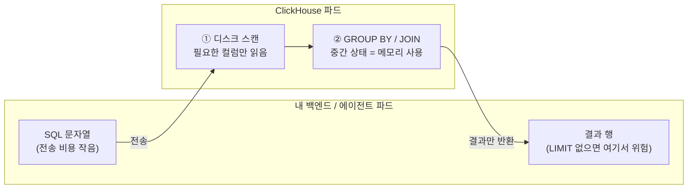
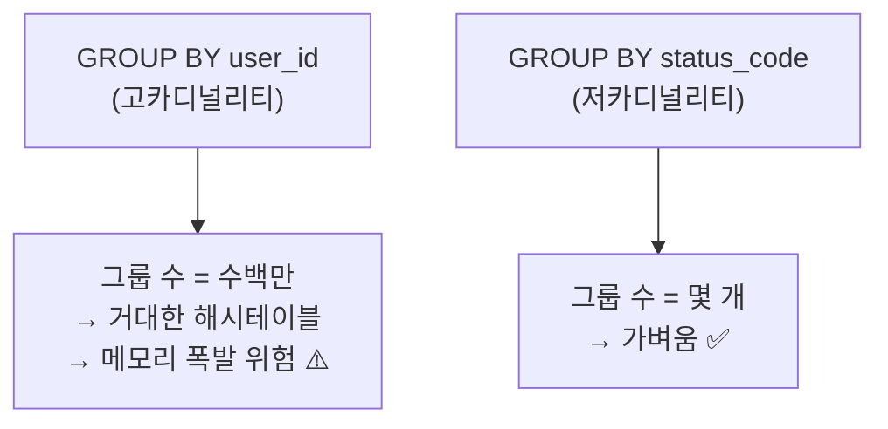
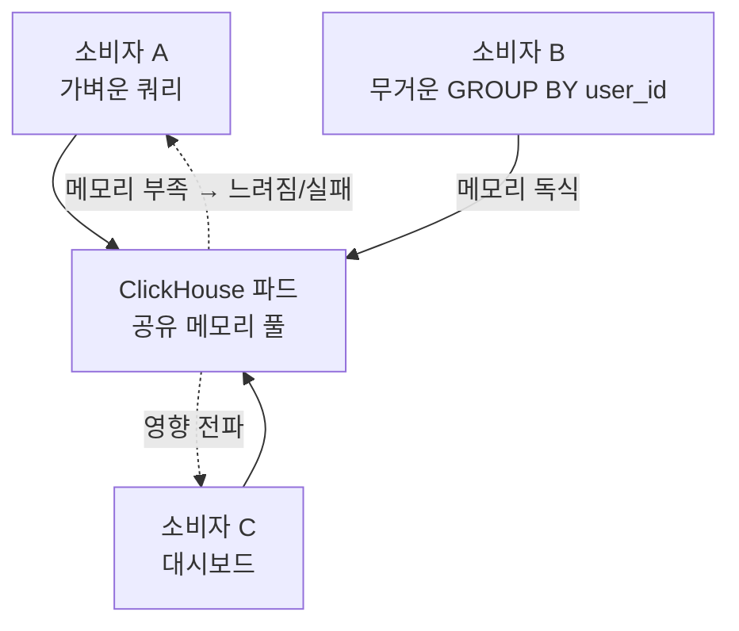

# 01. 자원 모델 — 메모리는 어디서 쓰이고, 누가 영향받나

> 핵심 한 줄: **무거운 계산(집계·조인)의 메모리는 "ClickHouse 파드"에서 쓰인다.** 내 백엔드 파드가 아니다.

## 쿼리가 흐르는 길과 메모리 주인

- **계산은 서버(ClickHouse) 쪽에서 끝난다.** 그래서 집계·조인이 메모리를 터뜨리면 **죽는 건 ClickHouse 파드(또는 그 쿼리)**, 내 백엔드가 아니다.
- ⚠️ **예외**: `LIMIT` 없이 수백만 행을 `SELECT`해서 내 백엔드가 통째로 받으면, 그땐 **내 백엔드 파드**가 터진다. → 스트리밍/페이징으로 받기.

## 카디널리티(cardinality)

| 구분 | 뜻 | 예 |
| --- | --- | --- |
| 고(高)카디널리티 | 서로 다른 값이 많다 = **중복이 적다** | `user_id`, UUID, ms 단위 timestamp |
| 저(低)카디널리티 | 값 종류가 몇 개뿐 = **중복이 많다** | `status_code`, `country`, `is_bot` |

왜 메모리와 직결되나 — `GROUP BY`는 **그룹마다 해시테이블 항목을 메모리에 만든다**:

> 참고: ClickHouse엔 저카디널리티 컬럼을 자동 최적화하는 `LowCardinality` 타입이 따로 있다 (추후 학습).

## 공유 자원의 영향 범위 (blast radius) — ★ 시스템 관점

ClickHouse는 보통 **여러 소비자가 함께 쓰는 공유 자원**이다. 누군가의 무거운 쿼리가 ClickHouse 파드 메모리를 독식하면, **나와 무관한 다른 소비자들의 쿼리까지 같이 느려지거나 실패**한다.

- 자원이 빡빡한 **온프레미스 k8s**에서는 이 영향 범위가 특히 치명적이다.
- 그래서 소비자로서 **"내 쿼리가 메모리를 얼마나 쓸지" 가늠하는 감각**이 단순 SQL 문법보다 중요하다.

## 관련 노트

- [[02-why-slow-over-time]] — 데이터가 쌓일수록 느려지는 문제와 설계적 해법
