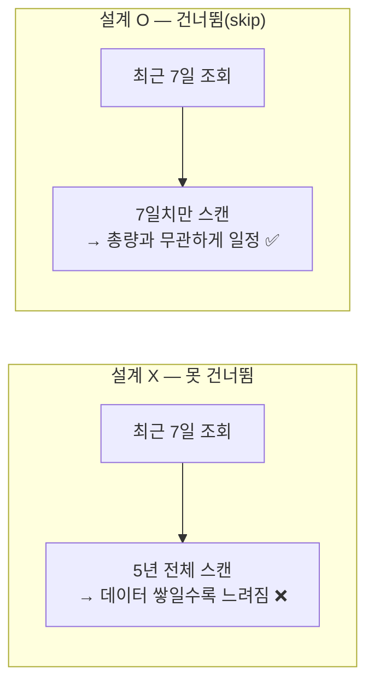
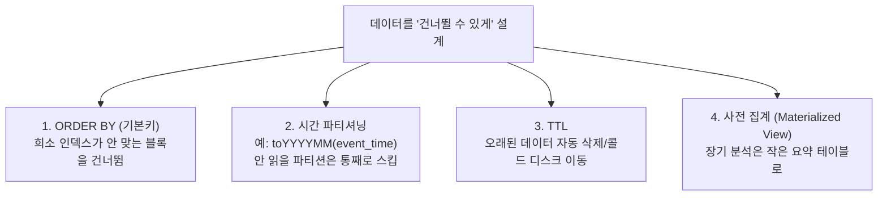

# 02. 데이터가 쌓일수록 쿼리가 느려진다면? (설계로 막기)

> ⚠️ 상태: **가설 / 검증 예정.** 아래 주장은 3·5·6단계에서 `EXPLAIN`과 `system` 테이블로 직접 확인한다.

## 핵심 원리

> ClickHouse에서 쿼리 속도는 **"총 저장량"이 아니라 "그 쿼리가 실제로 건드리는 데이터량"에 비례해야 정상**이다.
> 5년치가 쌓였다고 느려졌다면 = 쿼리가 옛날 데이터까지 **불필요하게 스캔**하도록 설계됐다는 신호.

## 해법 도구상자 (우선순위 순)

1. **ORDER BY (= 기본키) 설계** — 정렬키가 쿼리 필터와 맞아야 희소 인덱스로 블록(granule)을 건너뛴다. 안 맞으면 풀스캔.
2. **시간 기준 파티셔닝** — "최근 N일"만 읽고 나머지는 스킵(partition pruning). 오래된 파티션을 통째로 빠르게 삭제하기도 좋다.
   - 🪤 **함정**: 파티션을 너무 잘게(예: 일 단위 × 5년 = 1800여 개) 쪼개면 파트가 폭증해 **오히려 더 느려진다.** 보통 **월 단위**가 무난.
3. **TTL** — 5년을 다 뜨겁게 들고 있을 필요 없음. 뜨거운 데이터셋을 작게 유지 (tiered storage로 느린 디스크 이동 가능).
4. **사전 집계** — 원본 수십억 행 대신 미리 말아둔 요약 테이블을 친다 (`AggregatingMergeTree` 등).

## 결론(가설)

가장 본질은 **1번(정렬키) + 2번(파티셔닝)**. 이 둘이 없으면 TTL·사전집계로도 근본 해결이 안 된다.
사슬: *왜 느려졌나 → 데이터를 못 건너뛰니까 → 정렬키·파티션이 쿼리 패턴과 안 맞으니까.*

> 정확한 "정답"은 실제로 느려진 쿼리 양상(스캔량 / 파트 수 / 메모리 중 무엇이 병목이었나)에 따라 다르다. 위 4개는 ClickHouse 표준 도구상자이고 1·2번이 1순위라는 것이 공식 설계 원칙에 부합한다 — **3단계에서 검증.**

## 관련 노트

- [[01-resource-model]] — 메모리는 어디서 쓰이고 누가 영향받나
