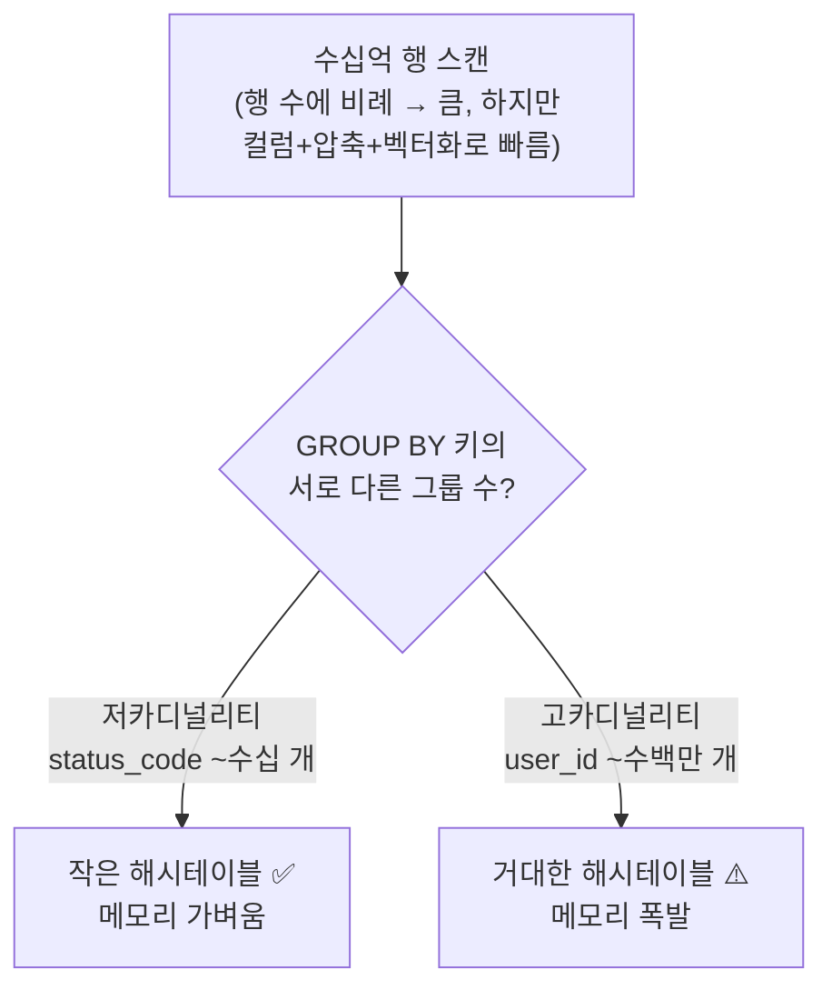
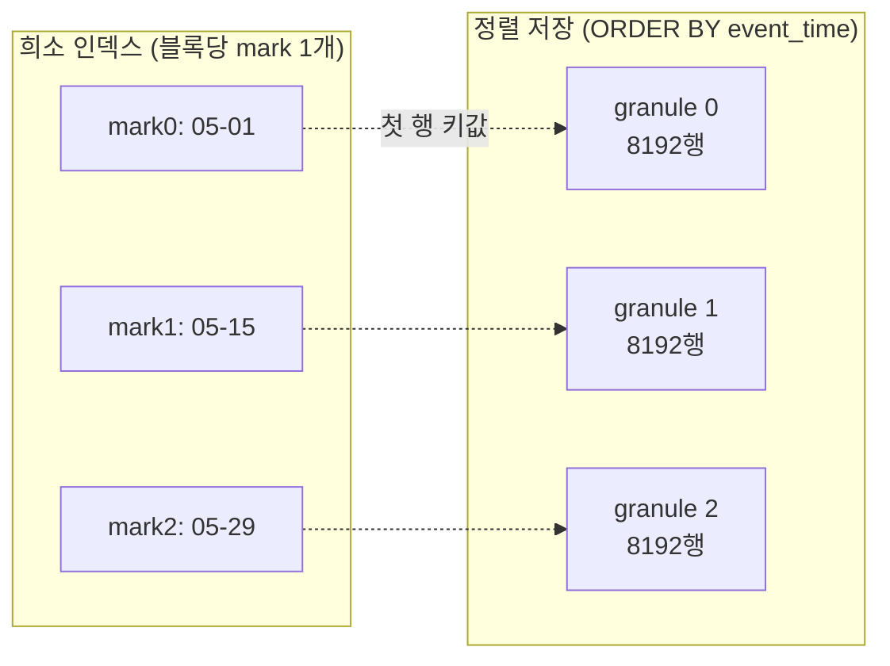
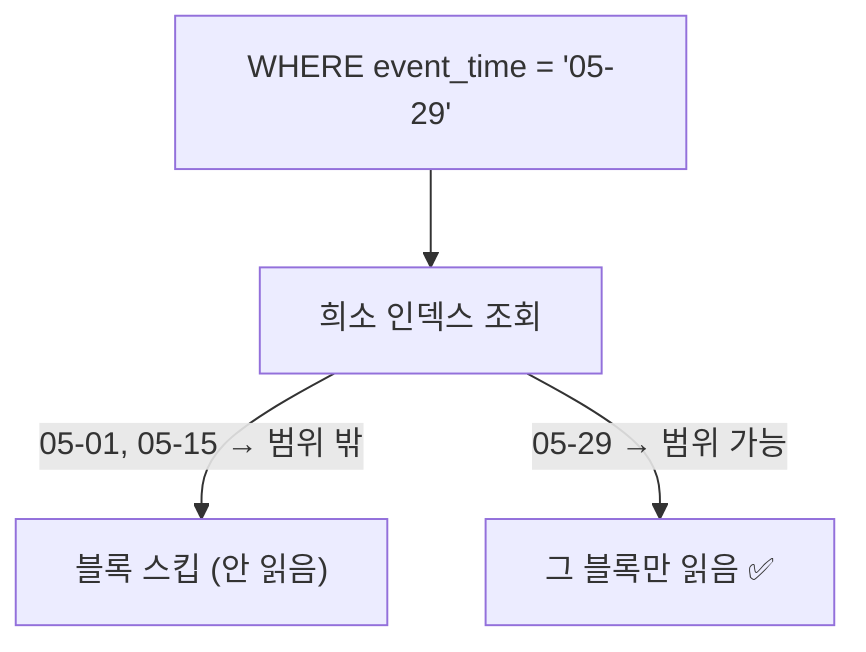
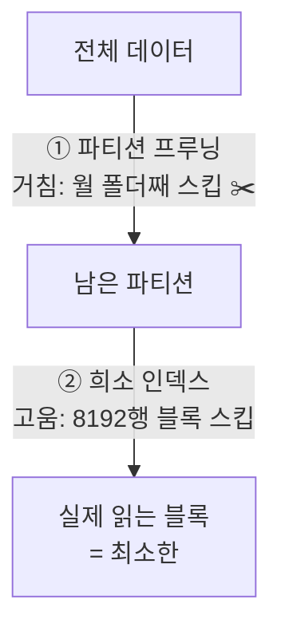

# 03. 왜 빠른가 — 카디널리티·희소 인덱스·파티션 프루닝

> ClickHouse가 빠른 근본 원리. 모두 **"건드리는 데이터를 최소화한다"**로 수렴한다.

## (A) 저카디널리티 GROUP BY가 가벼운 이유

"읽는 행 수"와 "그룹 해시테이블 크기"는 **별개**다. 가볍다는 건 **메모리** 얘기.

- **집계 메모리 = GROUP BY 키의 distinct 그룹 수에 비례** (읽는 행 수가 아님).
- 컬럼 지향이 또 도움: `GROUP BY status_code, SUM(bytes)`는 **그 두 컬럼만** 읽는다. 행 지향이면 안 쓰는 컬럼까지 통째로 읽어야 함.

## (B) ORDER BY = 기본키, 희소(sparse) 인덱스

MergeTree는 데이터를 **`ORDER BY` 순서대로 디스크에 정렬 저장**하고, 이 정렬키가 곧 **기본키**다.

> ⚠️ Postgres/MySQL과 다른 점: ClickHouse 기본키는 **유일성을 보장하지 않는다.** 그냥 정렬+인덱스용 키. 중복 가능.

인덱스가 "희소"한 이유 — **행마다(dense, B-tree)가 아니라 블록(granule, 기본 8192행)마다 1개**만 저장:

→ 인덱스가 작아서 메모리에 통째로 올릴 수 있다.

## (C) 블록 건너뛰기

정렬키로 필터하면, 인덱스를 보고 **범위 밖 블록은 디스크에서 아예 안 읽는다**:

- 그래서 데이터가 5년치든 5일치든, **읽는 블록 수는 쿼리 범위에만 비례.**
- 단 **정렬키가 필터 컬럼과 맞아야** 함. 안 맞으면 풀스캔 → [[02-why-slow-over-time]]의 함정.

## (D) 파티션 프루닝 vs 블록 스킵 — 2단계 깔때기

파티셔닝은 테이블을 **물리적으로 별도 덩어리로 쪼갬** (예: `PARTITION BY toYYYYMM(event_time)` → 월별 폴더). 쿼리 조건에 안 맞는 파티션은 **폴더째 안 열어봄(pruning = 가지치기).**

- 파티션 프루닝 = **거친** 단계(폴더째), 희소 인덱스 = **고운** 단계(블록째). 둘이 협력.

## 관련 노트

- [[01-resource-model]] · [[02-why-slow-over-time]]
