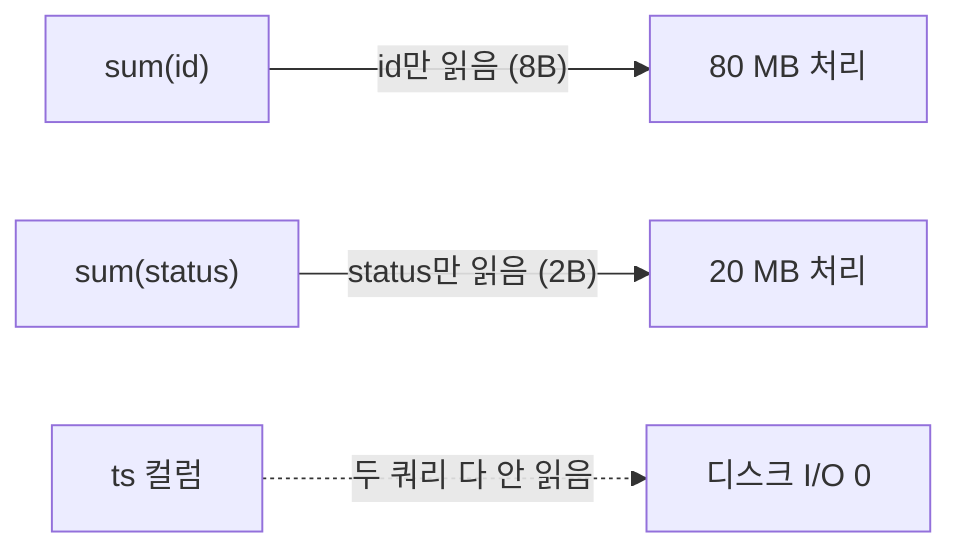

# 04. 실측 — 컬럼 지향·압축 (1천만 행)

> `demo_columnar` 테이블(`id UInt64`, `status UInt16`, `ts DateTime`, `ORDER BY id`)에 1천만 행 적재 후 측정.
> [[03-index-and-partitioning]]의 개념 (A)를 실측으로 확인.

## 저장: 컬럼별로 따로, 압축률도 따로 (`system.columns`)

| 컬럼 | 타입(바이트) | uncompressed | compressed | ratio | 이유 |
| --- | --- | --- | --- | --- | --- |
| `status` | UInt16 (2) | 19.07 MiB | **89.74 KiB** | **217.6** | 값 5종류뿐(저카디널리티) → LZ4가 반복을 포인터로 압축 |
| `id` | UInt64 (8) | 76.29 MiB | 38.19 MiB | 2.0 | 전부 고유하지만 **정렬키라 오름차순** → LZ4가 일부 잡음 |
| `ts` | DateTime (4) | 38.15 MiB | 38.31 MiB | **1.0** | 0~86399초 반복·요동(고엔트로피) → 압축 안 됨. 블록 헤더 탓에 오히려 살짝 큼 |

- **uncompressed = 행 수 × 타입 바이트** 그대로 (예: id 8B×1천만 = 80MB).
- 세 줄이 따로 나온다는 것 자체가 **컬럼이 물리적으로 분리 저장**된다는 증거.
- 압축률 = ①카디널리티 + ②정렬/엔트로피에 좌우. → **ORDER BY 선택이 저장 용량까지 결정.**

## 읽기: 건드린 컬럼만 디스크에서 읽는다

| 쿼리 | Processed(=읽은 양) | Peak mem |
| --- | --- | --- |
| `SELECT sum(id)` | 80 MB (id만) | 3.90 MiB |
| `SELECT sum(status)` | 20 MB (status만) | 1.09 MiB |

- **안 쓰는 컬럼은 아예 안 읽음** = 컬럼 지향의 읽기 이점. 행 지향이면 행 통째로 읽어야 함.
- `sum()`은 그룹이 1개라 메모리 미미 → [[01-resource-model]]의 "집계 메모리 ∝ 그룹 수" 실증.

## 압축 메커니즘 메모

- LZ4 = LZ77 계열, 반복 구간을 **back-reference(offset,length) 포인터**로 치환.
- 순차 증가값은 `Delta`/`DoubleDelta` 전용 코덱으로 더 줄일 수 있음 (추후 실험).
