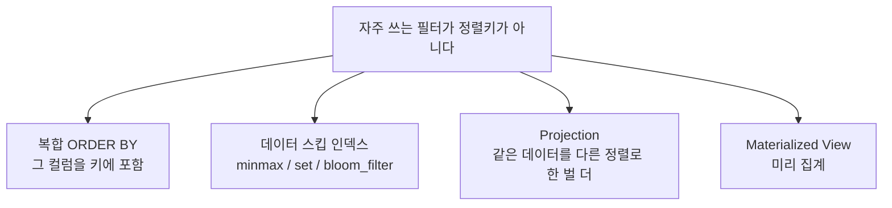

# 05. 소비자 관점 — 어떤 쿼리가 싸고 비싼가

> 소비자(쿼리 짜는 쪽)로서 가장 중요한 감각. [[03-index-and-partitioning]]의 블록 스킵을 실측으로 확인.

## 실측: 정렬키를 타면 블록을 건너뛴다

테이블 `demo_columnar` (`ORDER BY id`, 1천만 행, 1222 granule, 4 parts):

| 쿼리 | EXPLAIN | 읽은 행 | 비고 |
| --- | --- | --- | --- |
| `WHERE id BETWEEN ...` (정렬키) | `Granules: 1/1222`, `Parts: 1/4` | **8,192행** (1블록) | 결과 11건이어도 블록 통째로 |
| `WHERE status = 404` (정렬키 X) | 인덱스 못 씀 | **10,000,000행** (풀스캔) | 데이터 커지면 선형으로 느려짐 |

- **최소 읽기 단위 = 행이 아니라 블록(granule, 기본 8192행).** 11건만 필요해도 그 블록 전체를 읽음.
- `EXPLAIN indexes = 1`로 `Granules N/M`을 보면 스킵이 됐는지 직접 확인 가능.

## "정렬키 아닌 쿼리는 다 느린가?" → 못 건너뜀 ≠ 항상 느림

- ClickHouse는 **풀스캔도 빠르다**(컬럼+압축+벡터화). status=404 풀스캔 10M행이 0.016초.
- 진짜 문제는 **데이터가 거대해질 때** 풀스캔이 데이터량에 선형 비례 → [[02-why-slow-over-time]].
- 위 도구들로 정렬키 아닌 필터도 빠르게 만들 수 있음 (주로 데이터 엔지니어가 설계).
- **소비자 실전 감각: 테이블의 `ORDER BY`를 먼저 확인 → 내 필터가 싼지 비싼지 예측.**

## 안티패턴: `SELECT *` + 대량 행 가져오기

1. `SELECT *` = 모든 컬럼 읽음 → **컬럼 지향 이점을 스스로 버림.**
2. 행 대량 전송 → **클라이언트(내 백엔드) 메모리 폭발** ([[01-resource-model]]의 예외).

> ClickHouse는 "긁어서 요약(집계)" 도구지, "행 하나하나 꺼내보는"(OLTP) 도구가 아니다. 점조회는 Postgres/Scylla 몫.

**좋은 습관**: ⓐ 필요한 컬럼만 ⓑ 서버에서 집계해 작은 결과만 받기 ⓒ `LIMIT` ⓓ 가능하면 정렬키로 필터.
