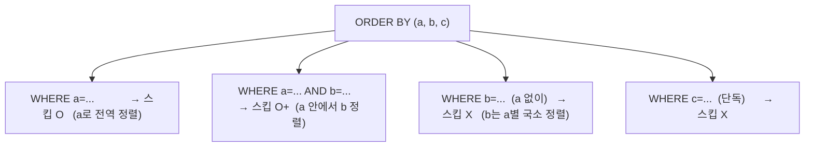

# 06. ORDER BY(정렬키) 설계 — 복합키와 비용

> 정렬키 설계는 쿼리 속도·압축·쓰기 비용을 한꺼번에 좌우한다. [[05-consumer-query-cost]] 연장선.

## 복합키 = 왼쪽 접두사(leftmost prefix) 규칙

`ORDER BY (a, b, c)`는 데이터를 `(a,b,c)` 사전식 순서로 정렬 저장. 블록 스킵은 **키 앞쪽부터 연속으로 조건을 줄 때만** 된다.

- 비유: 전화번호부가 `(성, 이름)` 순 → "성=김"은 빠름, "이름=철수"만은 전체 탐색.
- **MySQL 복합 인덱스의 leftmost prefix와 동일 원리.** (단 MySQL=dense, ClickHouse=sparse)

## 모든 컬럼을 키에 넣으면 손해 보는 지점

| 비용 | 내용 |
| --- | --- |
| **압축 저하** ⭐ | ORDER BY가 행 정렬 순서를 정함 → 뒤 컬럼 압축률 좌우. 키가 길고 앞에 고카디널리티가 오면 뒤가 안 뭉쳐 압축 망가짐 |
| 쓰기 비용↑ | INSERT·병합마다 긴 키로 정렬 → CPU↑ |
| 인덱스 메모리↑ | 희소 인덱스가 블록마다 키 값 보유 → 키 길수록 커짐 |
| 효용 없음 | prefix만 스킵에 쓰임 → 뒤 컬럼은 비용만 |

## 설계 지침

- 자주 **필터하는 컬럼을 앞**에 (스킵 이점).
- **카디널리티 낮은 컬럼을 앞**에 (압축·스킵 유리). 고카디널리티(timestamp 등)는 뒤로 — 단 시간범위 쿼리 잦으면 위치 조정.
- 키는 **짧게**. 필요시 `PRIMARY KEY`를 `ORDER BY`의 prefix로 따로 지정해 인덱스만 작게.
