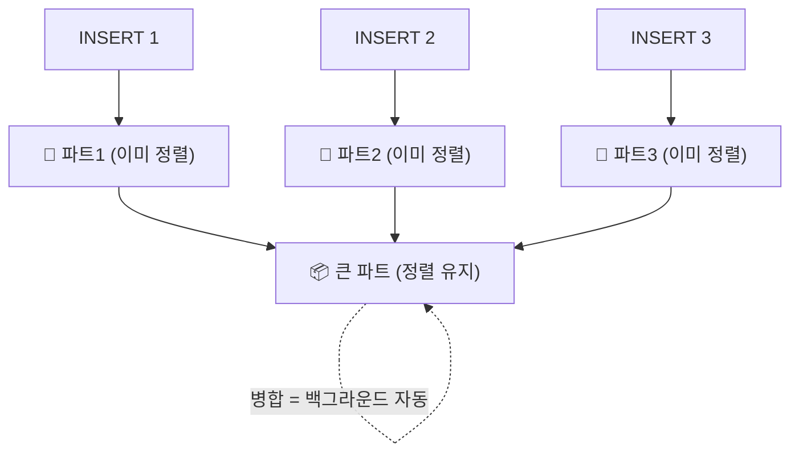

# 07. 파트와 병합 (MergeTree의 "Merge")

> "INSERT는 빠른데 데이터는 정렬돼 있다"가 어떻게 양립하나. 폴더 비유로 이해.

## 문제: 빠른 INSERT vs 정렬 유지 (충돌)

블록 스킵([[03-index-and-partitioning]])은 데이터가 정렬돼 있어서 가능. 그런데 이미 정렬된 1천만 행 사이에 새 행을 끼워넣으면 느림.

## 꼼수: INSERT = 새 "파트(폴더)"를 옆에 툭

> INSERT할 때마다 **그 데이터만 정렬해서 새 파트에 담아** 추가. 기존 파트는 안 건드림 → 빠름.



- **각 파트는 INSERT 시점에 이미 정렬됨.** 병합은 *나중에 정렬*이 아니라, **정렬된 파트들을 지퍼처럼 합쳐**(merge sort의 merge) 더 큰 정렬 파트로 만드는 것.
- 쿼리는 **살아있는(active) 파트를 전부** 읽음 → 파트가 많으면 느림 → 그래서 병합으로 수를 줄임.

## 실측으로 본 것

- 1천만 행 INSERT → 파트 4개, 0.247초 (기존 안 건드리고 새 파트만 추가).
- `OPTIMIZE TABLE ... FINAL` (강제 병합) → 6개 파트가 **1개로 합쳐짐**.

## 파트 이름 해독: `all_1_11_2`

```
all      파티션 이름 (PARTITION BY 없으면 전부 "all")
1        시작 블록 번호
11       끝 블록 번호
2        병합 레벨(level): 갓 INSERT=0, 합칠수록 ↑
```

## 연결: 과파티셔닝 함정

파티션을 잘게 쪼개면(예: 일 단위 × 5년) → 파티션마다 파트가 따로 생겨 **파트 수 폭발** → 쿼리가 다 뒤져 느려지고, 심하면 `too many parts` 에러. → [[02-why-slow-over-time]]의 함정 메커니즘.
