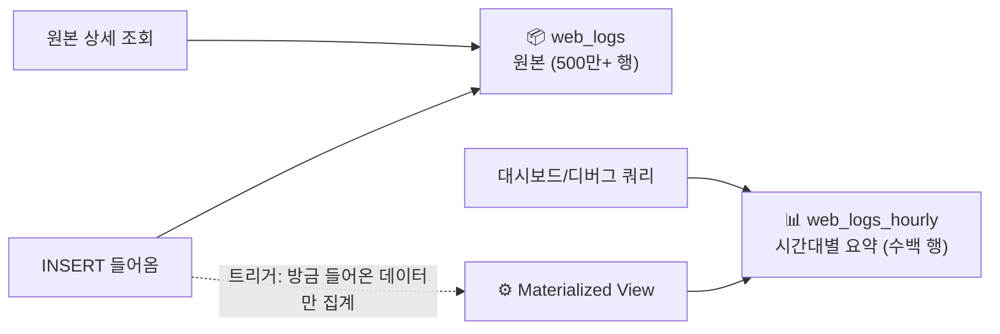
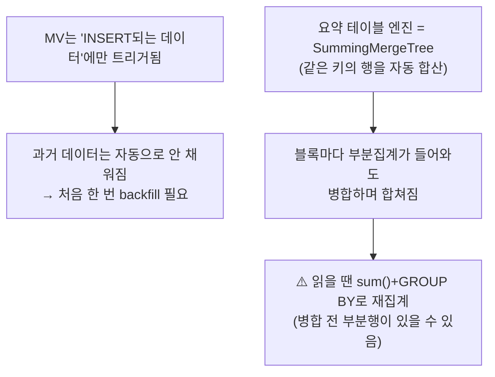

# 10. Materialized View — 적재 시 자동 사전집계

> 자주 던지는 집계 쿼리를 **INSERT 시점에 미리 계산**해 작은 요약 테이블에 누적. [[02-why-slow-over-time]]의 "사전집계"의 정체.

## 큰 그림

## 핵심 메커니즘 (꼭 이해)

- **MV = INSERT 트리거**: 원본에 새 데이터가 들어오면, 그 데이터만 집계해서 요약 테이블에 씀. 원본을 다시 읽는 게 아님.
- **과거 데이터 backfill**: MV 만들기 전 데이터는 안 들어가 있음 → 한 번 수동 INSERT로 채움.
- **SummingMergeTree**: ORDER BY 키가 같은 행들을 백그라운드 병합 때 **합산**. 그래서 시간대별 카운터가 누적됨.
- **읽기 주의**: 병합이 아직 안 된 부분행이 있을 수 있어, 정확히 읽으려면 `sum() + GROUP BY`로 한 번 더 묶는다 (또는 `FINAL`).

## 왜 좋은가 (소비자 관점)

- "시간대별 에러" 같은 쿼리가 원본 500만 행이 아니라 **요약 수백 행**을 침 → 메모리·IO 급감.
- 단점: 미리 정한 집계만 빨라짐(유연성↓), 원본+요약 **이중 저장**. → 자주·반복되는 집계에만 사용.

## 실측

- **backfill**: 169개 시간버킷 생성 (원본 5M행 1회 스캔, 0.044s).
- **요약 쿼리**: ~169행만 읽어 **0.007s**. 같은 결과를 원본에서 뽑으면 5M행 스캔 → 사전집계로 IO·메모리 급감.
- **라이브 트리거**: `web_logs`에 status=500 행 INSERT → `web_logs_hourly`를 직접 안 건드렸는데 자동 반영(`reqs/errors` 증가). MV = INSERT 트리거 실증.
- **부분행 확인**: 1000건 INSERT를 2번 → 같은 시각 버킷에 `(1000,1000)` 부분행 2개 생성 → `sum()+GROUP BY`가 2000으로 합산. SummingMergeTree "병합 전 부분행"을 라이브로 확인.
